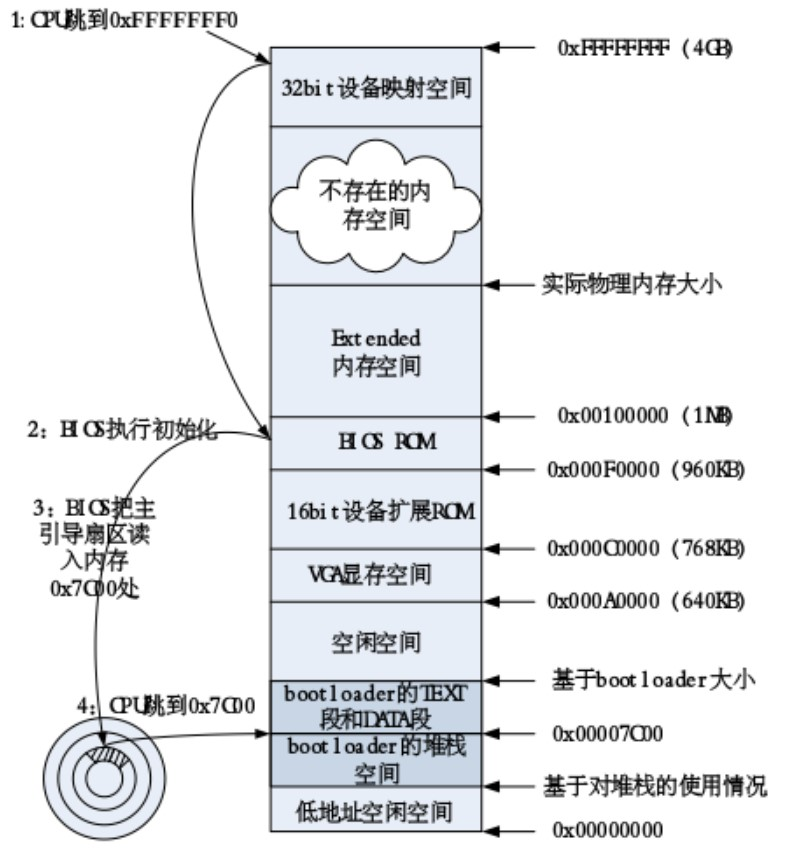

###练习一
```
+ cc kern/init/init.c
gcc -Ikern/init/ -fno-builtin -Wall -ggdb -m32 -gstabs -nostdinc  -fno-stack-protector -Ilibs/ -Ikern/debug/ -Ikern/driver/
 -Ikern/trap/ -Ikern/mm/ -c kern/init/init.c -o obj/kern/init/init.o
+ cc kern/libs/readline.c
gcc -Ikern/libs/ -fno-builtin -Wall -ggdb -m32 -gstabs -nostdinc  -fno-stack-protector -Ilibs/ -Ikern/debug/ -Ikern/driver/
 -Ikern/trap/ -Ikern/mm/ -c kern/libs/readline.c -o obj/kern/libs/readline.o
+ cc kern/libs/stdio.c
gcc -Ikern/libs/ -fno-builtin -Wall -ggdb -m32 -gstabs -nostdinc  -fno-stack-protector -Ilibs/ -Ikern/debug/ -Ikern/driver/
 -Ikern/trap/ -Ikern/mm/ -c kern/libs/stdio.c -o obj/kern/libs/stdio.o
+ cc kern/debug/kdebug.c
gcc -Ikern/debug/ -fno-builtin -Wall -ggdb -m32 -gstabs -nostdinc  -fno-stack-protector -Ilibs/ -Ikern/debug/ -Ikern/driver
/ -Ikern/trap/ -Ikern/mm/ -c kern/debug/kdebug.c -o obj/kern/debug/kdebug.o
+ cc kern/debug/kmonitor.c
gcc -Ikern/debug/ -fno-builtin -Wall -ggdb -m32 -gstabs -nostdinc  -fno-stack-protector -Ilibs/ -Ikern/debug/ -Ikern/driver
/ -Ikern/trap/ -Ikern/mm/ -c kern/debug/kmonitor.c -o obj/kern/debug/kmonitor.o
+ cc kern/debug/panic.c
gcc -Ikern/debug/ -fno-builtin -Wall -ggdb -m32 -gstabs -nostdinc  -fno-stack-protector -Ilibs/ -Ikern/debug/ -Ikern/driver
/ -Ikern/trap/ -Ikern/mm/ -c kern/debug/panic.c -o obj/kern/debug/panic.o
+ cc kern/driver/clock.c
gcc -Ikern/driver/ -fno-builtin -Wall -ggdb -m32 -gstabs -nostdinc  -fno-stack-protector -Ilibs/ -Ikern/debug/ -Ikern/drive
r/ -Ikern/trap/ -Ikern/mm/ -c kern/driver/clock.c -o obj/kern/driver/clock.o
+ cc kern/driver/console.c
gcc -Ikern/driver/ -fno-builtin -Wall -ggdb -m32 -gstabs -nostdinc  -fno-stack-protector -Ilibs/ -Ikern/debug/ -Ikern/drive
r/ -Ikern/trap/ -Ikern/mm/ -c kern/driver/console.c -o obj/kern/driver/console.o
+ cc kern/driver/intr.c
gcc -Ikern/driver/ -fno-builtin -Wall -ggdb -m32 -gstabs -nostdinc  -fno-stack-protector -Ilibs/ -Ikern/debug/ -Ikern/drive
r/ -Ikern/trap/ -Ikern/mm/ -c kern/driver/intr.c -o obj/kern/driver/intr.o
+ cc kern/driver/picirq.c
gcc -Ikern/driver/ -fno-builtin -Wall -ggdb -m32 -gstabs -nostdinc  -fno-stack-protector -Ilibs/ -Ikern/debug/ -Ikern/drive
r/ -Ikern/trap/ -Ikern/mm/ -c kern/driver/picirq.c -o obj/kern/driver/picirq.o
+ cc kern/trap/trap.c
gcc -Ikern/trap/ -fno-builtin -Wall -ggdb -m32 -gstabs -nostdinc  -fno-stack-protector -Ilibs/ -Ikern/debug/ -Ikern/driver/ -Ikern/trap/ -Ikern/mm/ -c kern/trap/trap.c -o obj/kern/trap/trap.o
+ cc kern/trap/trapentry.S
gcc -Ikern/trap/ -fno-builtin -Wall -ggdb -m32 -gstabs -nostdinc  -fno-stack-protector -Ilibs/ -Ikern/debug/ -Ikern/driver/ -Ikern/trap/ -Ikern/mm/ -c kern/trap/trapentry.S -o obj/kern/trap/trapentry.o
+ cc kern/trap/vectors.S
gcc -Ikern/trap/ -fno-builtin -Wall -ggdb -m32 -gstabs -nostdinc  -fno-stack-protector -Ilibs/ -Ikern/debug/ -Ikern/driver/ -Ikern/trap/ -Ikern/mm/ -c kern/trap/vectors.S -o obj/kern/trap/vectors.o
+ cc kern/mm/pmm.c
gcc -Ikern/mm/ -fno-builtin -Wall -ggdb -m32 -gstabs -nostdinc  -fno-stack-protector -Ilibs/ -Ikern/debug/ -Ikern/driver/ -Ikern/trap/ -Ikern/mm/ -c kern/mm/pmm.c -o obj/kern/mm/pmm.o
+ cc libs/printfmt.c
gcc -Ilibs/ -fno-builtin -Wall -ggdb -m32 -gstabs -nostdinc  -fno-stack-protector -Ilibs/  -c libs/printfmt.c -o obj/libs/printfmt.o
+ cc libs/string.c
gcc -Ilibs/ -fno-builtin -Wall -ggdb -m32 -gstabs -nostdinc  -fno-stack-protector -Ilibs/  -c libs/string.c -o obj/libs/string.o
+ ld bin/kernel
ld -m    elf_i386 -nostdlib -T tools/kernel.ld -o bin/kernel  obj/kern/init/init.o obj/kern/libs/readline.o obj/kern/libs/stdio.o obj/kern/debug/kdebug.o obj/kern/debug/kmonitor.o obj/kern/debug/panic.o obj/kern/driver/clock.o obj/kern/driver/console.o obj/kern/driver/intr.o obj/kern/driver/picirq.o obj/kern/trap/trap.o obj/kern/trap/trapentry.o obj/kern/trap/vectors.o obj/kern/mm/pmm.o  obj/libs/printfmt.o obj/libs/string.o
+ cc boot/bootasm.S
gcc -Iboot/ -fno-builtin -Wall -ggdb -m32 -gstabs -nostdinc  -fno-stack-protector -Ilibs/ -Os -nostdinc -c boot/bootasm.S -o obj/boot/bootasm.o
+ cc boot/bootmain.c
gcc -Iboot/ -fno-builtin -Wall -ggdb -m32 -gstabs -nostdinc  -fno-stack-protector -Ilibs/ -Os -nostdinc -c boot/bootmain.c -o obj/boot/bootmain.o
+ cc tools/sign.c
gcc -Itools/ -g -Wall -O2 -c tools/sign.c -o obj/sign/tools/sign.o
gcc -g -Wall -O2 obj/sign/tools/sign.o -o bin/sign
+ ld bin/bootblock
ld -m    elf_i386 -nostdlib -N -e start -Ttext 0x7C00 obj/boot/bootasm.o obj/boot/bootmain.o -o obj/bootblock.o
'obj/bootblock.out' size: 488 bytes
build 512 bytes boot sector: 'bin/bootblock' success!
dd if=/dev/zero of=bin/ucore.img count=10000
10000+0 records in
10000+0 records out
5120000 bytes (5.1 MB) copied, 0.174748 s, 29.3 MB/s
dd if=bin/bootblock of=bin/ucore.img conv=notrunc
1+0 records in
1+0 records out
512 bytes (512 B) copied, 0.000157387 s, 3.3 MB/s
dd if=bin/kernel of=bin/ucore.img seek=1 conv=notrunc
146+1 records in
146+1 records out
74923 bytes (75 kB) copied, 0.000851352 s, 88.0 MB/s
```


###练习三
bootloader完成了

- 打开A20
- 建立段描述符，全局描述符表
- 使能保护模式



sign是生成一个合格主引导区的工具
8042:The PS/2 Controller (often called a "Keyboard controller") is located on the mainboard. In the early days the controller was a single chip (8042). As of today it is part of the [Advanced Integrated Peripheral](http://wiki.osdev.org/Advanced_Integrated_Peripheral "Advanced Integrated Peripheral").
根据PA = CS * 16 + IP，实际可以寻址的最大地址应该是CS=0xFFFF并且IP=0xFFFF，这个地址超过了1MB。在80286之前，因为地址总线只有20位，所以，实际访问的地址是PA % 1MB的结果，也就是如果地址计算结果超过1MB，实际访问的内存会绕回到低地址。
在80286中，地址总线被扩充到24位。当地址总线扩充之后，一些依靠这种trick的DOS程序会出错，IBM为了保持PC的兼容性，在主板上的A20总线增加了一个门电路，称之为A20 Gate。
在开机默认状态下，A20 Gate是关闭的，此时A20地址线始终保持0，保证了向后的兼容性。通过特殊的方法，可以将A20 Gate开启，此时就可以自由访问所有内存。在众多开启A20 Gate的方法中，一种是使用键盘控制器8042的一个未被使用的管脚来当作A20 Gate的控制线，ucore使用的就是这种方法。

```
#include <asm.h>

# Start the CPU: switch to 32-bit protected mode, jump into C.
# The BIOS loads this code from the first sector of the hard disk into
# memory at physical address 0x7c00 and starts executing in real mode
# with %cs=0 %ip=7c00.

.set PROT_MODE_CSEG,        0x8                     # kernel code segment selector
.set PROT_MODE_DSEG,        0x10                    # kernel data segment selector
.set CR0_PE_ON,             0x1                     # protected mode enable flag

# start address should be 0:7c00, in real mode, the beginning address of the running bootloader
.globl start
start:
.code16                                             # Assemble for 16-bit mode
    cli                                             # Disable interrupts
    cld                                             # String operations increment

    # Set up the important data segment registers (DS, ES, SS).
    xorw %ax, %ax                                   # Segment number zero
    movw %ax, %ds                                   # -> Data Segment
    movw %ax, %es                                   # -> Extra Segment
    movw %ax, %ss                                   # -> Stack Segment

    # Enable A20:
    #  For backwards compatibility with the earliest PCs, physical
    #  address line 20 is tied low, so that addresses higher than
    #  1MB wrap around to zero by default. This code undoes this.
seta20.1:
    inb $0x64, %al                                  # Wait for not busy(8042 input buffer empty).
    testb $0x2, %al
    jnz seta20.1

    movb $0xd1, %al                                 # 0xd1 -> port 0x64
    outb %al, $0x64                                 # 0xd1 means: write data to 8042's P2 port

seta20.2:
    inb $0x64, %al                                  # Wait for not busy(8042 input buffer empty).
    testb $0x2, %al
    jnz seta20.2

    movb $0xdf, %al                                 # 0xdf -> port 0x60
    outb %al, $0x60                                 # 0xdf = 11011111, means set P2's A20 bit(the 1 bit) to 1

    # Switch from real to protected mode, using a bootstrap GDT
    # and segment translation that makes virtual addresses
    # identical to physical addresses, so that the
    # effective memory map does not change during the switch.
    lgdt gdtdesc
    movl %cr0, %eax
    orl $CR0_PE_ON, %eax
    movl %eax, %cr0

    # Jump to next instruction, but in 32-bit code segment.
    # Switches processor into 32-bit mode.
    ljmp $PROT_MODE_CSEG, $protcseg

.code32                                             # Assemble for 32-bit mode
protcseg:
    # Set up the protected-mode data segment registers
    movw $PROT_MODE_DSEG, %ax                       # Our data segment selector
    movw %ax, %ds                                   # -> DS: Data Segment
    movw %ax, %es                                   # -> ES: Extra Segment
    movw %ax, %fs                                   # -> FS
    movw %ax, %gs                                   # -> GS
    movw %ax, %ss                                   # -> SS: Stack Segment

    # Set up the stack pointer and call into C. The stack region is from 0--start(0x7c00)
    movl $0x0, %ebp
    movl $start, %esp
    call bootmain

    # If bootmain returns (it shouldn't), loop.
spin:
    jmp spin

# Bootstrap GDT
.p2align 2                                          # force 4 byte alignment
gdt:
    SEG_NULLASM                                     # null seg
    SEG_ASM(STA_X|STA_R, 0x0, 0xffffffff)           # code seg for bootloader and kernel
    SEG_ASM(STA_W, 0x0, 0xffffffff)                 # data seg for bootloader and kernel

gdtdesc:
    .word 0x17                                      # sizeof(gdt) - 1
    .long gdt                                       # address gdt
```
#####line16~17
Cli关中断，确保此时boot.s是唯一执行的程序
These instructions clear various flags.
- CLC clears the carry flag
- CLD clears the direction flag
- CLI clears the interrupt flag (thus disabling interrupts)
- CLTS clears the task-switched (TS) flag in CR0.

#####line20~23
段寄存器置零

#####line29~43
|Port|Mode|Description|
| ------------ | ------------ | ------------ |
|64h|read|8042 status register. Can be read at any time.  See table above for more information.   |
|64th|write|8042 command register. Writing this port sets Bit 3 of the status register to 1 and the byte is treated as a controller command.  Devices attached to the 8042 should be disabled before issuing commands that return data since data in the output register will be overwritten.|

#####line29~35
给64h端口发送d1指令
D1 Write Output Port: next byte written to port 60h is placed in the 8042 output port (which is inaccessible to the data bus)

即下次输出到60h port的数据将会发送到这个port

#####line36~43
0xdf = 11011111,使得gateA20被置1，虽然这里其他bit位也被修改，但是不影响：
>你的理解是对的，这样确实会改变 P2 的其他位，但因为是开机代码，所以做个完全的初始化也是没有问题的。

#####line49~52
加载gdt，应将CR0的bit 0位置1. 使能保护模式

每个段描述符占8个字节，第一个是NULL段描述符，没有意义，表示全局描述符表的开始
紧接着是代码段描述符（位于全局描述符表的0x8处的位置），具有可读（STA_R）和可执行（STA_X）的属性，并且段起始地址为0，段大小为4GB
接下来是数据段描述符（位于全局描述符表的0x10处的位置），具有可读（STA_R）和可写（STA_W）的属性，并且段起始地址为0，段大小为4GB。

加载gdt的命令是`lgdt gdtdesc`。在gdtdesc中指出了gdt的大小和地址

#####line56
通过长跳转指令进入保护模式。80386在执行长跳转指令时，会重新加载$PROT_MODE_CSEG的值（即0x8）到CS中，同时把$protcseg的值赋给EIP，这样80386就会把CS的值作为全局描述符表的索引来找到对应的代码段描述符，设定当前的EIP为0x7c32(即protcseg标号所在的段内偏移)，

长跳转指令ljmp \$PROT_MODE_CSEG, \$protcseg跳转到下一条代码，目的是跳过剩余的16位指令。此处我们看到新的GDT已经发挥作用，seg= PROT_MODE_CSEG, offset=protcseg，因为CSEG的基地址为0，则程序跳转到了代码段的protcseg偏移处

执行完这句后，就进入了保护模式。


#####line59~66

由于在访问数据或栈时需要用DS/ES/FS/GS和SS段寄存器作为全局描述符表的下标来找到相应的段描述符，所以还需要对DS/ES/FS/GS和SS段寄存器进行初始化，使它们都指向位于0x10处的段描述符（即gdt中的数据段描述符）。

#####line69~71

只有设置好的合适大小和地址的栈内存空间（简称栈空间），才能有效地进行函数调用。这里为了减少汇编代码量，我们就通过C代码来完成显示。由于需要调用C语言的函数，所以需要自己建立好栈空间。

由于start位置（0x7c00）前的地址空间没有用到，所以可以用来作为bootloader的栈，需要注意栈是向下长的，所以不会破坏start位置后面的代码。

###练习四

一般主板有2个IDE通道（是硬盘的I/O控制器），每个通道可以接2个IDE硬盘。
- 第一个IDE通道通过访问I/O地址0x1f0-0x1f7来实现
- 第二个IDE通道通过访问0x170-0x17f实现。每个通道的主从盘的选择通过第6个I/O偏移地址寄存器来设置。具体参数见下表。

<section class="normal" id="section-gitbook_3">

<pre>`
I/O地址    功能
0x1f0    读数据，当0x1f7不为忙状态时，可以读。
0x1f2    要读写的扇区数，每次读写前，需要指出要读写几个扇区。
0x1f3    如果是LBA模式，就是LBA参数的0-7位
0x1f4    如果是LBA模式，就是LBA参数的8-15位
0x1f5    如果是LBA模式，就是LBA参数的16-23位
0x1f6    第0~3位：如果是LBA模式就是24-27位
         第4位：为0主盘；为1从盘
         第6位：为1=LBA模式；0 = CHS模式
         第7位和第5位必须为1
0x1f7    状态和命令寄存器。操作时先给命令，再读取内容；
         如果不是忙状态就从0x1f0端口读数据
` </pre>

</section>

ucore通过gcc编译和ld链接，形成了ELF格式执行文件kernel（位于bin目录下），这样kernel的内部组成与一般的应用程序差别不大。一般而言，一个执行程序的内容是至少由 bss段、data段、text段三大部分组成。

- BSS段：BSS（Block Started by Symbol）段通常是指用来存放执行程序中未初始化的全局变量的一块存储区域。BSS段属于静态内存分配的存储空间。
- 数据段：数据段（Data Segment）通常是指用来存放执行程序中已初始化的全局变量的一块存储区域。数据段属于静态内存分配的存储空间。
- 代码段：代码段（Code Segment/Text Segment）通常是指用来存放程序执行代码的一块存储区域。这部分区域的大小在程序运行前就已经确定，并且内存区域通常属于只读, 某些CPU架构也允许代码段为可写，即允许修改程序。在代码段中，也有可能包含一些只读的常数变量，例如字符串常量等。

随着ucore的执行，可能需要进行函数调用，这就需要用到栈（stack）；如果需要动态申请内存，这就需要用到堆（heap）。堆和栈是在操作系统执行过程中动态产生和变化的，并不存在于表示内核的执行文件中。栈又称堆栈， 是用户存放程序临时创建的局部变量，即函数中定义的变量（但不包括static声明的变量，static意味着在数据段中存放变量）。除此以外，在函数被调用时，其参数也会被压入发起调用函数的栈中，并且待到调用结束后，函数的返回值也会被存放回栈中。由于栈的先进后出特点，所以栈特别方便用来保存/恢复调用现场。可以把栈看成一个寄存、交换临时数据的内存区。堆是用于存放运行中被动态分配的内存空间，它的大小并不固定，可动态扩张或缩减，这需要操作系统自己进行有效的管理。

main函数中，先调用readseg函数，读取ucore。这里指定8个扇区考虑ucore在内存中占用的空间（代码段+数据段）不大，8\*512Byte就够了。所以指定8个扇区。
如果ucore OS在内存中占用的空间要超过8个扇区，就需要调整了。
`readseg((uintptr_t)ELFHDR, SECTSIZE * 8, 0);`
```
static void readseg(uintptr_t va, uint32_t count, uint32_t offset) {
    uintptr_t end_va = va + count; //计算结束地址

    // round down to sector boundary
    va -= offset % SECTSIZE;

    // translate from bytes to sectors; kernel starts at sector 1
    uint32_t secno = (offset / SECTSIZE) + 1;

    // If this is too slow, we could read lots of sectors at a time.
    // We'd write more to memory than asked, but it doesn't matter --
    // we load in increasing order.
    for (; va < end_va; va += SECTSIZE, secno ++) {
        readsect((void *)va, secno);
    }
}
```
```
/* readsect - read a single sector at @secno into @dst */
static void readsect(void *dst, uint32_t secno) {
    // wait for disk to be ready
    waitdisk();

    outb(0x1F2, 1);                         // 读取一个扇区
    outb(0x1F3, secno & 0xFF);              // LBA参数
    outb(0x1F4, (secno >> 8) & 0xFF);
    outb(0x1F5, (secno >> 16) & 0xFF);
    outb(0x1F6, ((secno >> 24) & 0xF) | 0xE0);
    outb(0x1F7, 0x20);                      // cmd 0x20 - read sectors

    // wait for disk to be ready
    waitdisk();

    // read a sector
    insl(0x1F0, dst, SECTSIZE / 4); // 将数据放入内存
}
```
解析ELF并将程序加载到内存，然后执行：
1. 判断是否是一个合法的elf文件
// is this a valid ELF?
```
if (ELFHDR->e_magic != ELF_MAGIC) {
    goto bad;
}
```
2. 获取program header
```
ph = (struct proghdr *)((uintptr_t)ELFHDR + ELFHDR->e_phoff);
```
3. 获取ph的末尾地址，并将每个程序加载到其va地址
```
eph = ph + ELFHDR->e_phnum;
for (; ph < eph; ph ++) {
    readseg(ph->p_va & 0xFFFFFF, ph->p_memsz, ph->p_offset);
}
```
4. 从程序入口执行
```
((void (*)(void))(ELFHDR->e_entry & 0xFFFFFF))();
```

###练习五
```
uint32_t ebp = read_ebp(), eip = read_eip();
int i, j;
for (i = 0; ebp != 0 && i < STACKFRAME_DEPTH; i ++) {
    cprintf("ebp:0x%08x eip:0x%08x args:", ebp, eip);
    uint32_t *args = (uint32_t *)ebp + 2;
    for (j = 0; j < 4; j ++) {
        cprintf("0x%08x ", args[j]);
    }
    cprintf("\n");
    print_debuginfo(eip - 1);
    eip = ((uint32_t *)ebp)[1];
    ebp = ((uint32_t *)ebp)[0];
}
```

###练习六

实验六做的是设置中断向量表，通过SETGATE来设置，然后在中断响应处设置如何响应。另外陷阱和系统调用也可以在设置中断向量表这里设置

1. 8byte， 0~1及6~7是offset， 2~3是selector，两者加在一起是地址
2. Vectors是中断向量表，这里做的是

```
extern uintptr_t __vectors[];
int i;
for (i = 0; i < 256; i ++) {
    // GD_KTEXT指向ucore内部text段
    SETGATE(idt[i], 0, GD_KTEXT, __vectors[i], DPL_KERNEL);
}
// set for switch from user to kernel
SETGATE(idt[T_SWITCH_TOK], 0, GD_KTEXT, __vectors[T_SWITCH_TOK], DPL_USER);
// load the IDT
lidt(&idt_pd);
```

3.
```
ticks ++;
if (ticks % TICK_NUM == 0) {
    print_ticks();
}
```